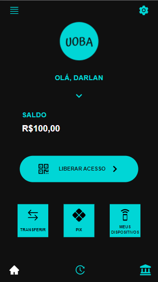
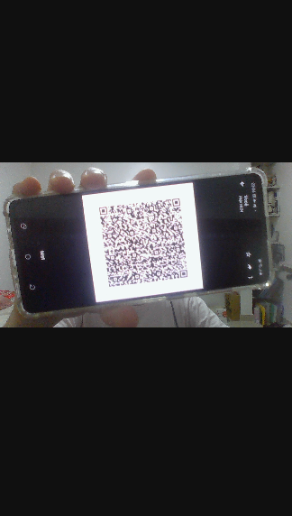
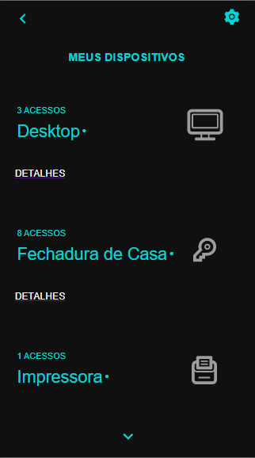
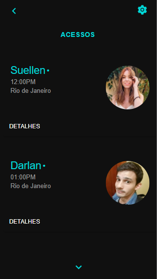
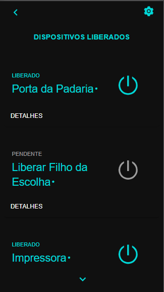

# UOBA (Unlock Open Banking For All) - App
### Verificação de identidade usando transferência PIX.

# Open Banking API

## Sobre o Frontend (/front)

### Iniciando a aplicação (Getting Started)

1. Navegue até a pasta raiz do front
#### `$ cd front`

2. Instale as dependências:
#### `$ yarn` ou `$ npm install`

3. Inicialize o app:
#### `$ yarn start` ou `$ npm start`

----
### Telas:
#### 1. Home

##### 🎈 Na tela principal é possível visualizar o saldo do seu cartão pré-pago, botão de acesso ao Pix, botão para começar a realizar transferência, botão para ir à tela que mostra seus dispositivos cadastrados para realizar autenticação. E logo no menu inferior pe possível entrar na tela de histórico de autenticações e um botão de configurações bancárias.

#### 2. QR Code - Autenticação 

##### 🎈 Nessa tela você apresenta na tela o QR Code do dispositivo para realizar a autenticação.

#### 3. Loading

##### 🎈 Após o QR Code autenticado uma tela de loading aparece enquanto que o serviço de autenticação é feito.

#### 4. Sucesso de Autenticação

##### 🎈 Com a autenticação bem sucedida você é informado junto com sua foto cadastrada.

#### 5. Meus Dispositivos

##### 🎈 O aplicativo possui uma forma de gerenciar todos os seus dispositivos cadastrados. É possível visualizar também a quantidade de acessos permitidos para cada um. Em detalhes é possível visualizar todos os acessos/usuários permitidos.

#### 6. Acessos

##### 🎈 Por aqui é possível visualizar todas as autenticações realizas/permitidas em um determinado dispositivo.

#### 7. Histórico de Dispositivos

##### 🎈 Nessa tela é possível visualizar todas as autenticações do usuário em outros dispositivos

### ✨ O App desenvolvido em React além de ser um PWA (Progressive Web App) no qual pode ser acessado em navegadores (mobile e web) é possível migrar todas as suas funcionalidades para React Native (aplicativo nativo Android ou IOS) substituindo apenas algumas codificações (html, scss) para JSX. ✨

----

## Sobre o Backend (/api)

### Getting Started
1. Navegue até a pasta raiz da API:
#### `$ cd api`

2. Instale as dependências
#### `$ yarn` ou `$ npm install`

3. Instale o PostgreSQL mais recente

4. Renomeie o arquivo .env-example para .env

5. Configure-o

6. Execute o servidor
#### `$ npm run watch`

7. Acesse:
#### `http://localhost:5445/docs`

### Detalhes do backend

Mais informações sobre a API

- Ao executar, a api irá fornecer um link de documentação mais técnico (feita em Open API 3)

- Uma abstração da lógica do serviço de autenticação de pagamento:

----

## Sobre as Tecnologias

### Frontend:

**React 17**: como framework de sigle page application

**Material UI 4**: para auxiliar na aparência dos componentes

### Backend:
**Node 14.6**: como ambiente de execução;

**Typescript 3.9**: como linguagem de programação;

**Express 4.17**: para fornecer as rotas e iniciar o servidor REST;

**Sequelize 6.3**: para definir, manipular e consultar o banco de dados;

**PostgreSQL 12**: como SGBD, podendo ser facilmente substituído por outro;

**Swagger (Open API 3)**: para documentar as rotas;
