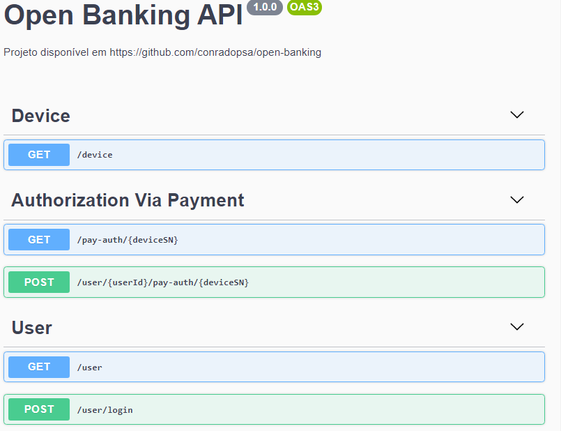
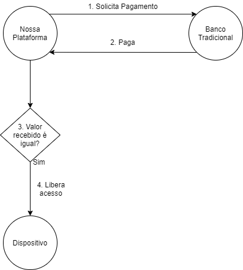

# UOBA (Unlock Open Banking For All) - App
### Verificação de identidade usando transferência PIX.

## Sobre o Backend (/api)

### Getting Started
1. Navegue até a pasta raiz da API:
#### `$ cd api`

2. Instale as dependências
#### `$ yarn` ou `$ npm install`

3. Instale o PostgreSQL mais recente

4. Renomeie o arquivo .env-example para .env

5. Configure-o

6. Execute o servidor
#### `$ npm run watch`

7. Acesse:
#### `http://localhost:5445/docs`

### Mais sobre o backend

#### Ao executar, a api irá fornecer um link de documentação mais técnico (feita em Open API 3):

Na sessão "Authorization Via Payment", temos um método post (/user/{userId}/pay-auth/{deviceSN}) que é o centro da nossa ideia.
Nesse método, ocorrerá o que chamamos de "bate-volta" de pagamentos, usando as APIs do open banking, para realizar a autenticação de um disposivo. 
Abaixo temos uma abstração da lógica desse serviço:

Ainda na sessão "Authorization Via Payment", o método get (/pay-auth/{deviceSN}), irá servir para dispositivos verificarem se irão conceder acesso ou não, através do atributo status que será um valor verdadeiro ou falso (autenticado ou não).
